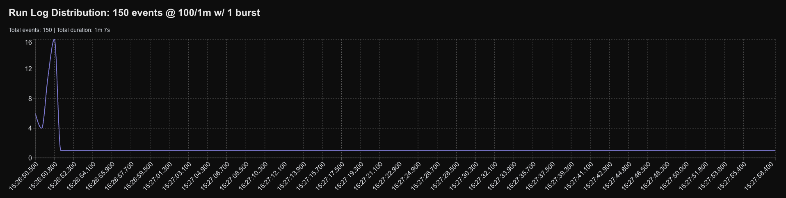

# Inngest Throttling Test
This repo contains a basic project which demonstrates Inngest behaviour around throttling and bursting.

## Problem

Inngest is an event-based job scheduling and running service that supports function-level throttling configuration. The throttling config allows you to specify that `n` function invocations should start every `[period]` (e.g., `10/2 minutes` means 10 invocations per 2 minutes).

Additionally, you may optionally specify a `burst` number which controls how function invocations should be spread across the time period. The default `burst` value is `1`, which specifies that there should be no burst and all invocations should be evenly spread across the time period.

**The Issue:** Regardless of the value of `burst`, the function invocations are not being evenly distributed across the specified time period as expected. Instead, they appear to be executed with a large initial burst, followed by a significantly reduced rate of invocation.

This repository contains a simple function implementation that demonstrates this behavior. The intended usage is to vary the throttle configuration in the `logRunEvent` function code (located in `inngest/functions/logRunEvent/index.ts`) and observe how the throttling behaves. The function is currently configured with a throttle of `100/1m` (100 invocations per minute) with `burst: 1`. When 100 events are triggered, they should be evenly distributed across the 1-minute period, but the visualization shows they are not.

The project includes a web interface that graphs the actual invocation timestamps, making it easy to see how the throttling behaves with different configurations.

### 150 events @ 100 events per minute (Burst 1)



## Running this project

### Prerequisites

- Node.js and pnpm installed
- Supabase CLI installed
- Docker running (required for Supabase local development)

### Setup

1. Install dependencies:
   ```bash
   pnpm install
   ```

2. Start Supabase locally:
   ```bash
   pnpm supabase:start
   ```
   This will start all Supabase services including the database, API, and Studio.

3. (Optional) Reset the database if needed:
   ```bash
   pnpm supabase:reset
   ```
   This will reset the database and run all migrations.

4. Start the Inngest dev server:
   ```bash
   pnpm inngest:dev
   ```
   This runs the Inngest CLI in development mode to handle your Inngest functions.

5. Start the Next.js development server:
   ```bash
   pnpm dev
   ```

The application will be available at [`http://localhost:3000`](http://localhost:3000).  
Supabase Studio will be available at [`http://localhost:54323`](http://localhost:54323).  
Inngest will be available at [`http://localhost:8288`](http://localhost:8288).
